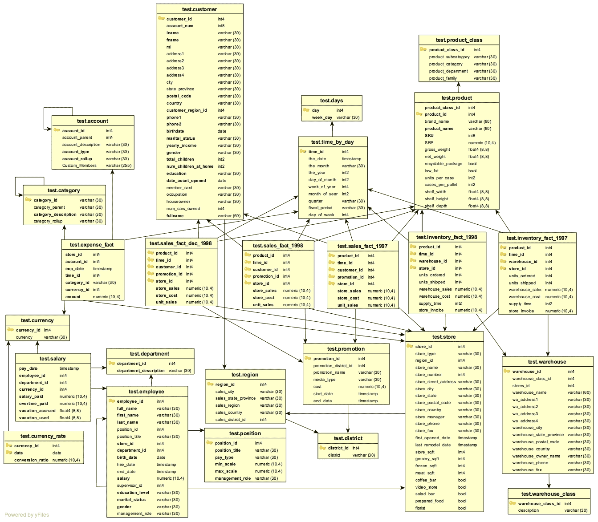

<!--

Licensed to Julian Hyde under one or more contributor license
agreements.  See the NOTICE file distributed with this work
for additional information regarding copyright ownership.
Julian Hyde licenses this file to you under the Apache
License, Version 2.0 (the "License"); you may not use this
file except in compliance with the License.  You may obtain a
copy of the License at

http://www.apache.org/licenses/LICENSE-2.0

Unless required by applicable law or agreed to in writing,
software distributed under the License is distributed on an
"AS IS" BASIS, WITHOUT WARRANTIES OR CONDITIONS OF ANY KIND,
either express or implied.  See the License for the specific
language governing permissions and limitations under the
License.

-->
[](https://github.com/julianhyde/foodmart-data-hsqldb/actions?query=branch%3Amain)

# foodmart-data-hsqldb
Foodmart data set in hsqldb format

This project contains the FoodMart data set as an embedded
HSQLDB database.

It originated as part of the test suite of the
<a href="https://mondrian.pentaho.org">Pentaho Mondrian OLAP engine</a>.

# Schema

Foodmart contains 37 tables:
* 7 fact tables: sales_fact_1997, sales_fact_1998, sales_fact_dec_1998,
  inventory_fact_1997, inventory_fact_1998, salary, expense_fact
* 19 dimension tables: product, customer, time_by_day, employee and more
* 11 aggregate tables

Its size is about 24MB uncompressed, 8MB compressed.

Here is a schema diagram:



# Using the data set

The data set is packaged as a jar file that is published to
[Maven Central](https://search.maven.org/#search%7Cga%7C1%7Ca%3Afoodmart-data-hsqldb)
as a Maven artifact. To use the data in your Java application,
add the artifact to your project's dependencies:

```xml
<dependencies>
  <dependency>
    <groupId>org.hsqldb</groupId>
    <artifactId>hsqldb</artifactId>
    <version>2.5.1</version>
  </dependency>
  <dependency>
    <groupId>net.hydromatic</groupId>
    <artifactId>foodmart-data-hsqldb</artifactId>
    <version>0.5</version>
  </dependency>
</dependencies>
```

(foodmart-data-hsqldb requires Java 8 or higher, and HSQLDB 2.0.0 or higher;
Java 11
<a href="http://hsqldb.org/doc/2.0/changelist_2_0.txt">is required</a>
for HSQLDB 2.6.0 and higher.)

Now you can connect using Java code:

```java
import java.sql.Connection;
import java.sql.Statement;
import java.sql.ResultSet;

Connection connection =
    DriverManager.getConnection("jdbc:hsqldb:res:foodmart",
        "FOODMART", "FOODMART");
Statement statement = connection.createStatement();
ResultSet resultSet =
    statement.executeQuery("select \"employee_id\", \"full_name\"\n"
        + "from \"foodmart\".\"employee\"");
while (resultSet.next()) {
  System.out.println(resultSet.getInt(1) + ":" + resultSet.getString(2));
}
resultSet.close();
statement.close();
connection.close();
```

You can also connect using a JDBC interface such as [sqlline](https://github.com/julianhyde/sqlline).
Make sure that `foodmart-data-hsqldb.jar` is on the class path, and start `sqlline`:

```sql
$ ./sqlline
sqlline version 1.12.0
sqlline> !connect jdbc:hsqldb:res:foodmart sa ""
0: jdbc:hsqldb:res:foodmart> select count(*) from "foodmart"."sales_fact_1997";
+----------------------+
|          C1          |
+----------------------+
| 86837                |
+----------------------+
1 row selected (0.004 seconds)
0: jdbc:hsqldb:res:foodmart> !quit
```

## Get foodmart-data-hsqldb

### From Maven

Get foodmart-data-hsqldb from
<a href="https://search.maven.org/#search%7Cga%7C1%7Cg%3Anet.hydromatic%20a%3Afoodmart-data-hsqldb">Maven Central</a>:

```xml
<dependency>
  <groupId>net.hydromatic</groupId>
  <artifactId>foodmart-data-hsqldb</artifactId>
  <version>0.5</version>
</dependency>
```

### Download and build

Java version 11 or higher.

```bash
$ git clone git://github.com/julianhyde/foodmart-data-hsqldb.git
$ cd foodmart-data-hsqldb
$ ./mvnw install
```

On Windows, the last line is

```bash
> mvnw install
```

### Make a release

See [hydromatic-parent](https://github.com/julianhyde/hydromatic-parent).

## See also

Similar data sets:
* [chinook-data-hsqldb](https://github.com/julianhyde/chinook-data-hsqldb)
* [flight-data-hsqldb](https://github.com/julianhyde/flight-data-hsqldb)
* [foodmart-data-json](https://github.com/julianhyde/foodmart-data-json)
* [foodmart-data-mysql](https://github.com/julianhyde/foodmart-data-mysql)
* [foodmart-queries](https://github.com/julianhyde/foodmart-queries)
* [scott-data-hsqldb](https://github.com/julianhyde/scott-data-hsqldb)
* [steelwheels-data-hsqldb](https://github.com/julianhyde/steelwheels-data-hsqldb)

## More information

* License: Apache License, Version 2.0
* Author: Julian Hyde
* Blog: https://blog.hydromatic.net
* Project page: http://www.hydromatic.net/foodmart-data-hsqldb
* Source code: https://github.com/julianhyde/foodmart-data-hsqldb
* Developers list:
  <a href="mailto:dev@calcite.apache.org">dev at calcite.apache.org</a>
  (<a href="https://mail-archives.apache.org/mod_mbox/calcite-dev/">archive</a>,
  <a href="mailto:dev-subscribe@calcite.apache.org">subscribe</a>)
* Issues: https://github.com/julianhyde/foodmart-data-hsqldb/issues
* <a href="HISTORY.md">Release notes and history</a>
